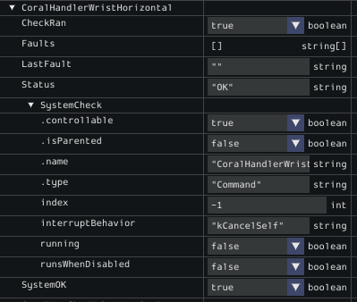

# Testy

A SystemCheck Monitor that shows faults of all subsystems listed in `/SmartDashboard/SystemStatus/`.


## Installation
Download binary from Release.

## Development
```bash
$ nix-shell
$ bun tauri dev
```